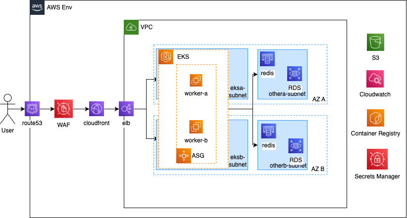

Provide your solution here:

# Architecture Overview and Functionality

## Architecture Diagram

## Cloud Services and Their Roles

- **Route 53**: DNS management to efficiently route user requests.
- **WAF (Web Application Firewall)**: Protects the application from malicious attacks.
- **CloudFront**: Caches static content and distributes it globally for faster access.
- **ELB (Elastic Load Balancer)**: Distributes incoming requests evenly to the backend servers.
- **EKS (Elastic Kubernetes Service)**: Orchestrates and manages the containerized applications.
- **ASG (Auto Scaling Group)**: Automatically scales EC2 instances based on traffic and load.
- **EC2 (Elastic Compute Cloud)**: Runs the containerized applications within the EKS cluster.
- **Elasticache (Redis)**: Provides in-memory caching to reduce database load and improve performance.
- **RDS (Relational Database Service)**: Stores structured and transactional data with high availability.
- **S3 (Simple Storage Service)**: Stores static files, backups, and large objects securely and durably.
- **CloudWatch**: Monitors system performance and application logs, enabling observability.
- **Container Registry**: Stores Docker container images for deployment on EKS.
- **Secrets Manager**: Secures sensitive data such as API keys, passwords, and database credentials.

## Scaling Plan

1. **EKS and ASG Scaling**
   - **Node Scaling**: Auto Scaling Group (ASG) adjusts EC2 nodes based on defined `minSize` and `maxSize`.
   - **Pod Scaling**: Horizontal Pod Autoscaler (HPA) scales pods automatically based on CPU and memory usage.

2. **Monitoring and Alerts**
   - **Resource Monitoring**: Utilize CloudWatch to track resource usage.
   - **Alerting**: Set up alerts for resource thresholds (e.g., 80% usage) to trigger capacity planning and resource adjustments.

3. **Database and Cache Scaling**
   - **RDS**: Use read replicas and multi-AZ deployments for high availability and improved read performance.
   - **Elasticache**: Scale Redis clusters vertically (by upgrading instance types) or horizontally (by sharding data).

## Summary

This architecture ensures high availability, scalability, and cost-effectiveness by leveraging AWS-managed services. With the given components, it can handle 500 requests per second with a p99 response time of under 100ms, meeting the specified requirements.

